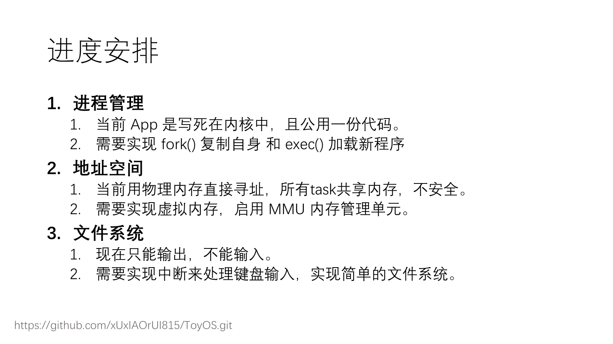

## 进度
1. 系统初始化 (Initialization)

    Log: [Kernel] Initializing tasks... Task 0/1/2 created.

    动作：内核启动，执行 task_init()。

    细节：
    创建了 3 个 TCB (任务控制块)。
    虽然 3 个任务运行的是同一份二进制代码 (user/app.bin)，但每个任务都被分配了独立的内核栈和用户栈。

    关键点：将每个任务的 ra (返回地址) 伪造为 __restore_to_user。这意味着一旦调度到它，它就会“假装”是从中断返回，直接跳入用户态。

2. 启动调度 (Bootstrap)
    Log: [Kernel] Starting schedule...
    Log: [Kernel] Idle -> Task 0

    动作：main 函数调用 schedule()。

    细节：
    这是操作系统的第一次切换。
    当前运行的是 Idle 线程（即启动时的 main 流程）。
    调度器保存 Idle 的上下文 (idle_cx)，加载 Task 0 的上下文。

    CPU 跳转到 __restore_to_user，执行 sret，特权级从 S-Mode 降级为 U-Mode，开始执行用户程序。

3. 用户态执行与主动让出 (User Execution & Yield)
    Log: Hello, I am a Task! ... yielding now... (1/3)

    动作：Task 0 在用户态打印字符，然后调用 sys_yield()。

    流程：
    用户程序调用 sys_yield -> 触发 ecall 指令。
    Trap (陷入)：CPU 进入内核态，跳转到 __alltraps (在 trap_entry.S 中)。

    保存现场：将 Task 0 的用户态寄存器保存到其内核栈的 TrapContext 中。

    分发：trap_handler 识别出系统调用号 124，调用 task_yield()。

4. 任务切换 (Context Switch)

    Log: [Kernel] Switch 0 -> 1

    动作：内核决定挂起 Task 0，运行 Task 1。

    细节：
    调用 __switch(&task[0].context, &task[1].context)。

    核心：这是一次 “横向”切换。CPU 的 sp (栈指针) 从 Task 0 的内核栈，瞬间变为了 Task 1 的内核栈。
    当 __switch 函数返回 (ret) 时，CPU 实际上是回到了 Task 1 上次调用 switch 的地方（或者 Task 1 的伪造入口）。

5. 轮转调度与恢复 (Round Robin & Resume)

    Log: Switch 1 -> 2 ... Switch 2 -> 0
    Log: I am back! Yielding again... (2/3)

    动作：Task 2 让出 CPU，调度器切回 Task 0。

    细节：
    Task 0 再次获得 CPU。
    它是从 sys_yield 系统调用返回之后的那一行代码继续执行的。

    这证明了 上下文保存与恢复 是完美的：Task 0 完全不知道自己被暂停过，继续执行后面的打印语句。

6. 任务结束 (Exit)

    Log: [Kernel] App 0 exited. ... All tasks finished!

    动作：App 执行完所有逻辑，调用 sys_exit()。

    细节：内核将该任务标记为 is_running = 0，不再调度它。当所有任务都变为 0 时，OS 停机。

## 代码结构

1. 启动与构建 (Boot & Build)

    Makefile：
    自动化构建脚本。负责分别编译 User App 和 Kernel，处理链接脚本，并启动 QEMU。

    os/entry.S：
    机器入口。系统上电的第一行代码，负责设置最初的栈 (boot_stack)，然后跳转到 C 语言 main。

    os/main.c：
    内核入口。负责初始化各个模块 (Trap, Task)，并启动调度器。

2. 硬件抽象层 (HAL / LibOS)

    os/sbi.c：
    与 OpenSBI 固件交互的接口，主要用于串口输出 (console_putchar)。

    os/printf.c：
    实现了内核级的格式化输出，用于 Log 打印。

3. 内存与加载 (Loader)

    os/link_app.S：
    静态加载器。将编译好的 user/app.bin 直接以二进制数据的形式嵌入内核数据段。

    user/linker.ld：
    规定用户程序的运行地址固定在 0x80400000。

4. 特权级与中断 (Trap Subsystem) 

    os/trap/trap_entry.S：
    汇编级中断处理。

    __alltraps：保存用户态 32 个通用寄存器 (User Context)。

    __restore / __restore_to_user：恢复用户态寄存器，执行 sret 返回用户态。

    关键点：处理了 sp 和 sscratch 的交换，解决了栈指针空指针崩溃 Bug。

    os/trap/trap.c：
    C 语言中断分发。解析 scause，处理系统调用 (sys_write, sys_exit, sys_yield)。

5. 多任务调度 (Task Subsystem) 

    os/switch.S：
    任务上下文切换。

    __switch：只保存/恢复 Callee-Saved 寄存器 (ra, sp, s0-s11)，实现两个内核线程间的切换。

    os/task.c：
    任务管理器。
    定义了 TaskControlBlock (TCB)。
    实现了 task_init (创建任务栈) 和 schedule (FIFO/轮转调度算法)。

    关键修复：解决了 Main 线程覆盖 Task 0 的 Bug (引入 idle_cx)，以及栈溢出踩踏 Bug (调整结构体顺序)。

6. 用户程序 (Userland)

    user/app.c：
    运行在 U-Mode 的测试程序。演示了系统调用封装和主动让出 (sys_yield) 的逻辑。

## 进度安排

- 实现了 Trap 机制，支持系统调用 (syscall)。
- 实现了 任务切换 (Context Switch)，内核可以保存暂停任务的上下文，并恢复另一个任务。
- 实现了 协作式调度器，支持 sys_yield 主动让权。

## 系统调用的实现
app.c中把命令放进寄存器，当CPU执行到ecall时，会把当前程序计数器保存到sepc，把异常原因保存到scause中，跳转到alltraps，CPU跳转到内核态后，通用寄存器中存的还是用户程序的数据，需要把他们保存到内核栈，以免内核代码运行时把他们覆盖，换栈。 把32个寄存器和status和sepc都sd到内核栈上，然后再把栈顶地址传给C函数。
内核检查scause，如果是8，说明是系统调用，转交给syscall函数。
恢复，把保存在栈中的寄存器全都ld回CPU寄存器，换栈。
降级，CPU会把 sepc的值回PC，权限从S-Mode降回U-Mode

## 上下文切换
TaskContext结构体和switch汇编
中断/系统调用，Trap阶段，要保存32个通用寄存器，保护用户态现场。
但是任务切换阶段，两个任务都运行在内核态。
任务切换发生在schedule函数调用Switch时。
定义结构体TaskContext
ra返回地址 执行完ret后，指令跳去哪里。
sp 栈指针 接下来的代码在那个栈上运行，TaskA的内核栈还是TaskB 的内核栈？
Switch 冻结当前任务
a0指向当前任务的context结构体内存
把当前的内核栈指针存入内存，当前的返回地址存入内存，保存
a1 指向下一个任务的context结构体内存

## 进程管理
现在的OS中，Task0，1，2都运行在物理内存的0x80400000这个地址上，因为他们运行的是同一份代码，且不修改代码段，所以能跑。
shell需要能fork，如果task0fork了task1，那么task1必须有自己独立的栈、独立的数据，但是必须认为自己也运行在0x80400000。
此时会出现冲突，物理内存中只有一个0x80400000。

引入MMU内存管理单元和Page Table页表。
- 物理内存管理 (Frame Allocator)：管理物理内存，知道哪些页是空的，哪些是用的。
- 虚拟内存管理 (Mapping)：建立“虚拟地址 -> 物理地址”的映射表（页表）。
- 进程管理 (Process)：重构 Task，给每个任务分配独立的页表，实现 fork。
